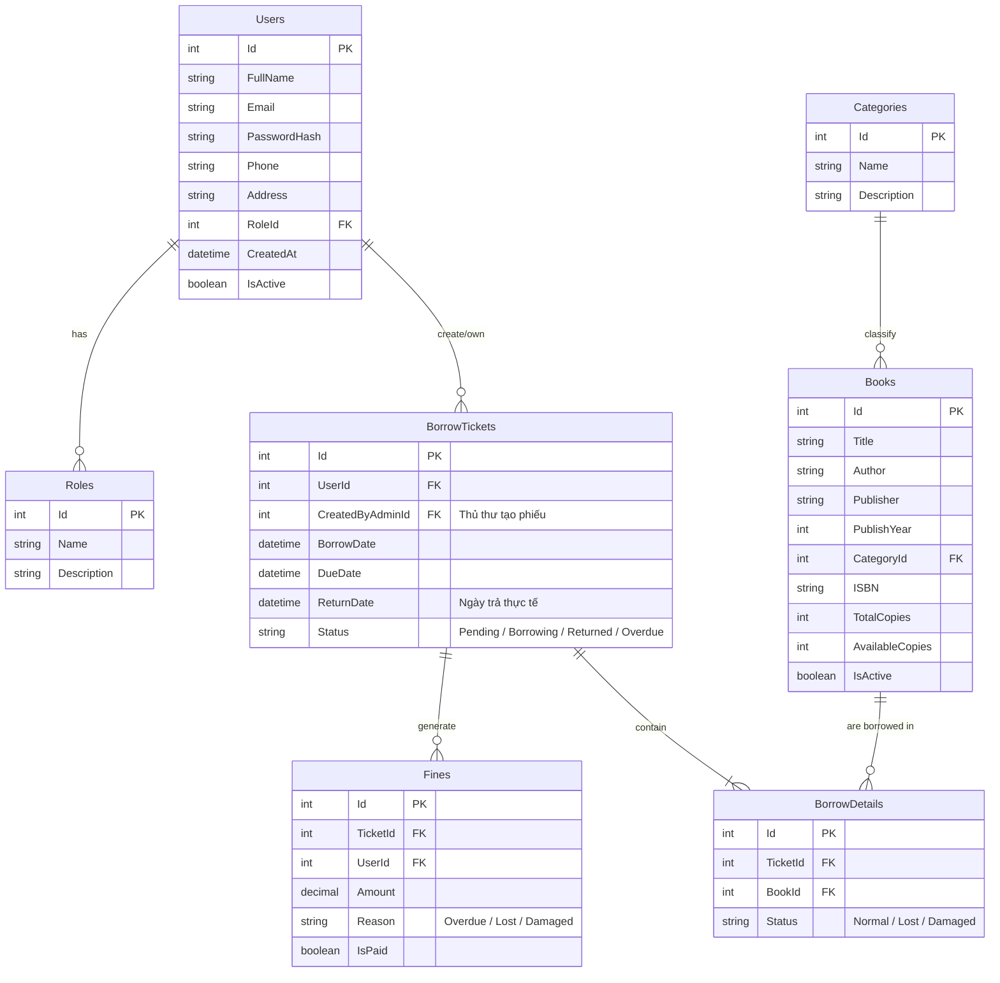

# Sơ đồ Cơ sở Dữ liệu (Database Schema / ERD)

Dưới đây là thiết kế mô hình cơ sở dữ liệu (Entity Relationship Diagram) cho hệ thống Quản lý Thư Cáo dựa trên các Use Case đã phân tích.

### Các Entity Chính:
1. **Users & Roles:** Quản lý tài khoản (Độc giả, Thủ thư, Admin). Phân biệt quyền thao tác bằng RoleId.
2. **Books & Categories:** Sách và Danh mục sách. Lưu số lượng tồn kho `AvailableCopies` (cập nhật liên tục khi có mượn/trả).
3. **BorrowTickets & BorrowDetails:** Quản lý giao dịch mượn/trả sách. Một Phiếu Mượn có thể có nhiều chi tiết (Mượn nhiều sách cùng lúc).
4. **Fines:** Lịch sử nộp phạt (nếu trả quá hạn hoặc sách bị hư hỏng). Tương ứng trực tiếp với Phiếu Mượn vi phạm.
